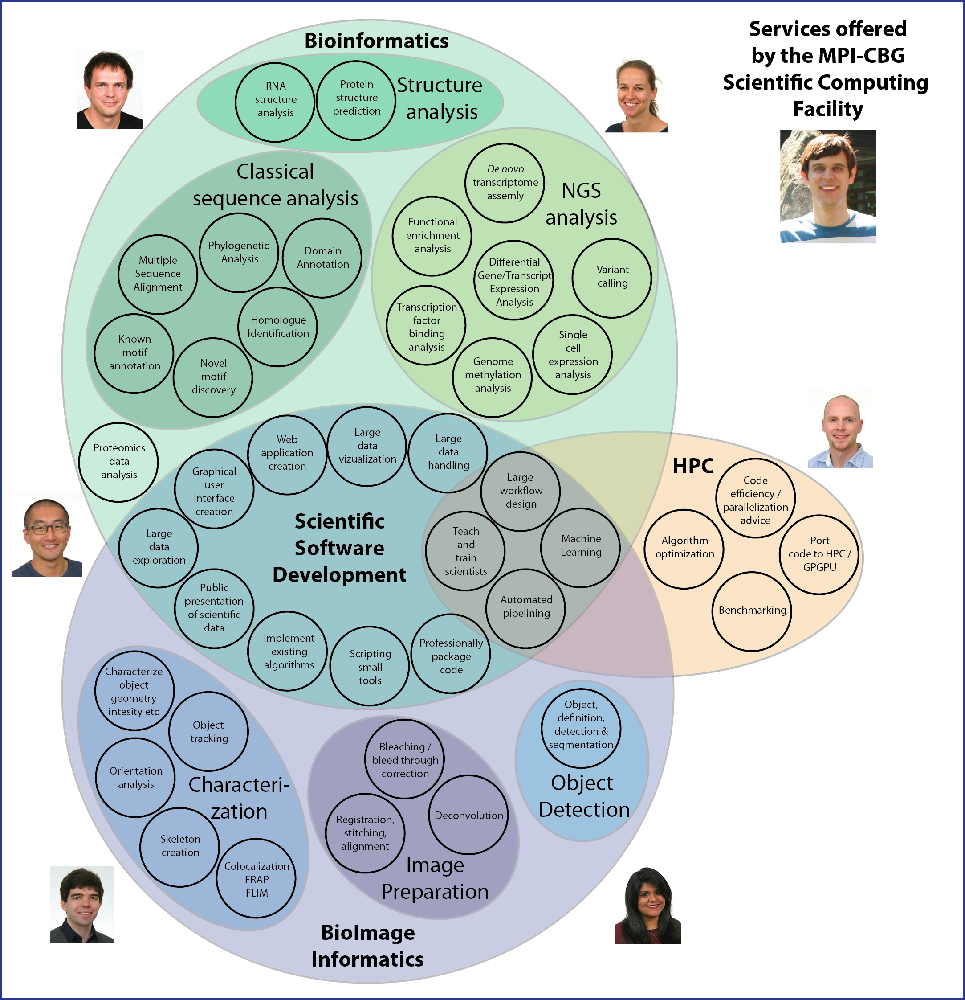
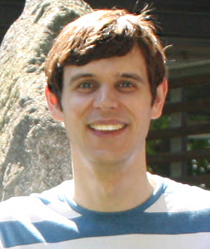
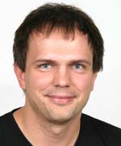
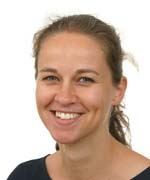
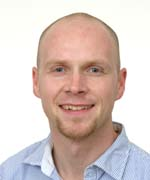
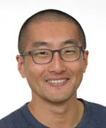
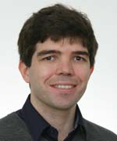
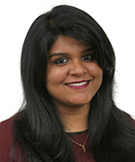

| Overview | [Bioinfo](./bioinfo/index.md) | [BioImage analysis](./biis/index.md) | [Scientific Software Dev](./scidev/index.md) | [HPC](./hpc/index.md) | [Teaching](./teaching/index.md)

## Scientific Computing Facility Overview

The Scientific Computing Facility provides a unified service to assist researchers in the tackling of scientific questions involving computational analysis, data handling and image processing.  The nature of modern biological research and the movement from small scale studies to analysis of data on a global scale (genomics, transcriptomics, proteomics) requires significant computational analysis and expertise across a wide variety of fields. Modern studies often produce multiple types of 'omics data and may also include high throughput imaging data, thus requiring techniques ranging from biological sequences analysis through to image processing/analysis.  The Scientific Computing Facility combines expertise in bioinformatics data analysis, bioimage analysis and software development to produce robust workflows, algorithms and tools for the analysis, exploration and visualization of large complex datasets of mixed datatypes.

## Team Members

|  | Name | Job Title | Interests |
| --- | --- | --- | --- |
| | Ian Henry | Facility Leader | Info here |
| | Holger Brandl | Senior Data Engineer | Info here |
| | Lena Hersemann | Bioinformatician | Info here |
| | Peter Steinbach | HPC Developer | Info here |
| | HongKee Moon | Senior Software Developer | Info here |
| | Benoit Lombardot | Senior Image Analyst | Info here |
| | Gayathri Nadar | Image Analyst | Info here |
