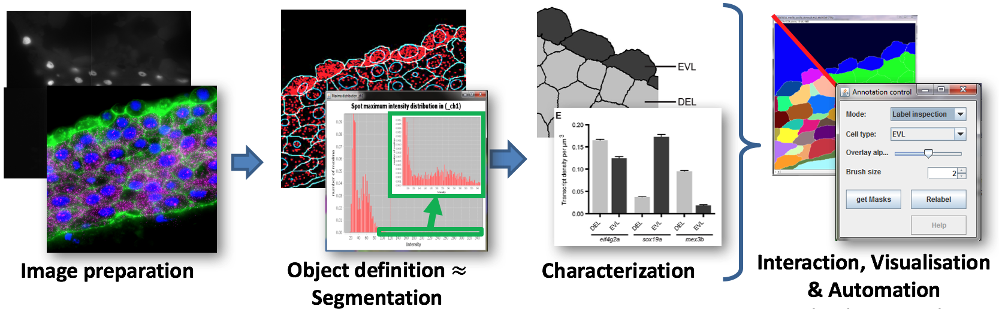

| [Overview](../README.md) | [Bioinfo](../bioinfo/index.md) | BioImage analysis | [Scientific Software Dev](../scidev/index.md) | [HPC](../hpc/index.md) | [Teaching](../teaching/index.md)

## BioImage Informatics Team

The BioImage informatics team provides informatics tools and training to support the analysis of images in biological studies.  

|  | Name | Job Title | Interests |
| --- | --- | --- | --- |
| | Benoit Lombardot | Senior Image Analyst | Info here |
| | Gayathri Nadar | Image Analyst | Info here |

## Image Analysis Services

 
* Image Preparation
  * Registration
  * Deconvolution
  * bleaching / bleed-through correction
  
  
* Object definition
  * Detection and segmentation
  * Define regions, points and lines that represent biological objects

* Characterization
  * object measures are used to test hypothesis and assess the model characterizing a particular biological phenomena

* Interaction, Visualisation, Automation
  * throughout the different analysis steps above users need to input information and assess analysis results
  * we provide tools to make this analysis more streamlined and reproducible

## Service types
* We provide a walk-in service for short questions or projects here we can demonstrate tools of interest and provide direct, almost instantaneous help
* For more complex projects, planned consulting sessions allow us to discuss project specifics in more detail in order to  designing a custom analysis pipeline
* This can lead to the development of custom scripts and plugins that automate analysis tasks in the proposed pipeline.
* Besides direct support the service also provides image analysis courses to raise awareness about specific tools and their usage

## Software supported
* Fiji/ImageJ
* Imaris
* Matlab
* Huygens
* Cell profilier
* Illastik
* Knime
* R/Rstudio

## Publications

L Carine Stapel, Benoit Lombardot, Coleman Broaddus, Dagmar Kainmueller, Florian Jug, Eugene W Myers, Nadine Vastenhouw 
Automated detection and quantification of single RNAs at cellular resolution in zebrafish embryos. 
Development, 143(3) 540-546 (2016)

Mykola Mylenko, Sebastian Boland, Sider Penkov, Julio Sampaio, Benoit Lombardot, Daniela Vorkel, Jean-Marc Verbavatz, Teymuras V. Kurzchalia 
NAD+ Is a Food Component That Promotes Exit from Dauer Diapause in Caenorhabditis elegans. 
PLoS ONE, 11(12) Art. No. e0167208 (2016)

