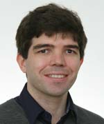

| [Overview](../README.md) | [Bioinfo](../bioinfo/index.md) | BioImage analysis | [Scientific Software Dev](../scidev/index.md) | [HPC](../hpc/index.md) | [Teaching](../teaching/index.md)

## BioImage Informatics Team

The BioImage informatics team provides informatics tools and training to support the analysis of images in biological studies.  

|  | Name | Job Title | Interests |
| --- | --- | --- | --- |
| | Benoit Lombardot | Senior Image Analyst | Info here |
| | Gayathri Nadar | Image Analyst | Info here |

## Image Analysis Services

## Publications

L Carine Stapel, Benoit Lombardot, Coleman Broaddus, Dagmar Kainmueller, Florian Jug, Eugene W Myers, Nadine Vastenhouw 
Automated detection and quantification of single RNAs at cellular resolution in zebrafish embryos. 
Development, 143(3) 540-546 (2016)

Mykola Mylenko, Sebastian Boland, Sider Penkov, Julio Sampaio, Benoit Lombardot, Daniela Vorkel, Jean-Marc Verbavatz, Teymuras V. Kurzchalia 
NAD+ Is a Food Component That Promotes Exit from Dauer Diapause in Caenorhabditis elegans. 
PLoS ONE, 11(12) Art. No. e0167208 (2016)

