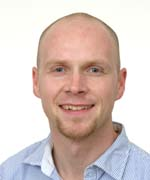

| [Overview](../README.md) | [Bioinfo](../bioinfo/index.md) | [BioImage analysis](../biis/index.md) | Scientific Software Dev | [HPC](../hpc/index.md) | [Teaching](../teaching/index.md)

## Scientific Software Development Team

The scientific software development team designs, constructs, and deploys scientific applications within the MPI-CBG. It also ensures that software created within the institute is of the highest quality.

|  | Name | Job Title | Interests |
| --- | --- | --- | --- |
| | Peter Steinbach | Senior HPC Developer | Info here |
| | HongKee Moon | Senior Software Developer | Info here |

## Scientific Software Development Services

* Design, implement, deploy and maintain software applications for
  * Presentation and display of scientific data to the community
  * Intuitive use of sophisticated complex algorithms/workflows for
    * Wet-lab biologists @ MPI-CBG
    * Scientific community as a whole

* Guidance support and training to
  * Help scientists improve research code and turn it into distributable applications
and packages
  * Improve algorithm efficiency and parallelization of code to improve processing speed
  * Port code to HPC platforms (cluster, GPGPU)

## Publications

Andrei Rozanski, HongKee Moon, Holger Brandl, José M Martín-Durán, Markus Grohme, Katja Hüttner, Kerstin Bartscherer, Ian Henry, Jochen Rink 
PlanMine 3.0-improvements to a mineable resource of flatworm biology and biodiversity. 
Nucleic Acids Res, 47 Art. No. D812–D820 (2018)

Peter Steinbach, Matthias Werner 
gearshifft – The FFT Benchmark Suite for Heterogeneous Platforms 
<i>
In: High performance computing ; 32nd international conference, ISC High Performance 2017, Frankfurt, Germany, June 18-22, 2017 : proceedings </i>
(2017)(Eds.) Julian Kunkel (Lecture Notes in Computer Science ; 10266), Cham, Springer International Publishing (2017), 199-216

Holger Brandl, HongKee Moon, Miquel Vila-Farré, Shang-Yun Liu, Ian Henry, Jochen Rink 
PlanMine - a mineable resource of planarian biology and biodiversity. 
Nucleic Acids Res, 44 Art. No. D764–D773 (2016)

Helge Knoop, Tobias Gronemeier, Christoph Knigge, Peter Steinbach 
Porting the MPI Parallelized LES Model PALM to Multi-GPU Systems – An Experience Report 
<i>
In: High performance computing : ISC High Performance 2016 international workshops ExaComm, E-MuCoCoS, HPC-IODC, IXPUG, IWOPH, P^3MA, VHPC, WOPSSS, Frankfurt, Germany, June 19-23, 2016 : revised selected papers</i>
(2016) Lecture Notes in Computer Science ; 9945, Cham, Springer International Publishing (2016), 508-523

Christopher Schmied, Peter Steinbach, Tobias Pietzsch, Stephan Preibisch, Pavel Tomancak 
An automated workflow for parallel processing of large multiview SPIM recordings. 
Bioinformatics, 32(7) 1112-1114 (2016)

Anurag Priyam, Ben J Woodcroft, Vivek Rai, Alekhya Munagala, Ismail Moghul, Filip Ter, Mark Anthony Gibbins, HongKee Moon, Guy Leonard, Wolfgang Rumpf, Yannick Wurm 
Sequenceserver: a modern graphical user interface for custom BLAST databases. 
Biorxiv (2015): 033142

Stefan Kluth, Maria Grazia Pia, Thomas Schoerner-Sadenius, Peter Steinbach 
How do particle physicists learn the programming concepts they need? 
<i>
In: 21ST INTERNATIONAL CONFERENCE ON COMPUTING IN HIGH ENERGY AND NUCLEAR PHYSICS (CHEP2015), PARTS 1-9</i>
(2015) Ch. 62048 (Journal of Physics Conference Series ; 664,6), Bristol, UK, Institute of Physics Publishing (IOP) (2015)

